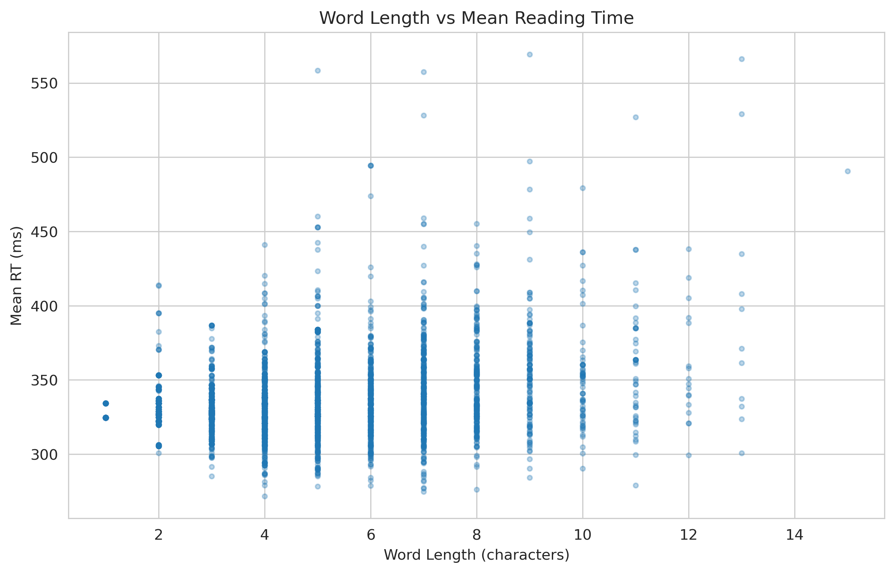
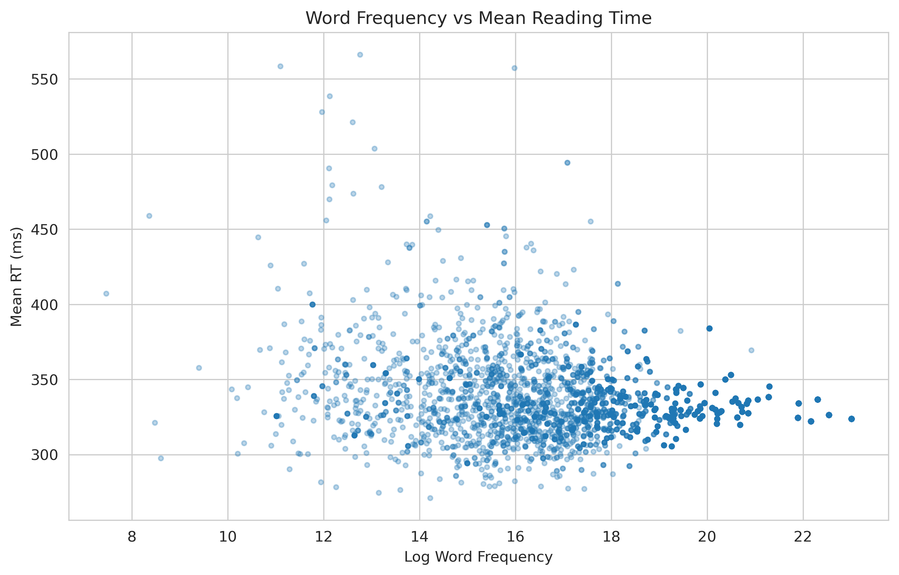
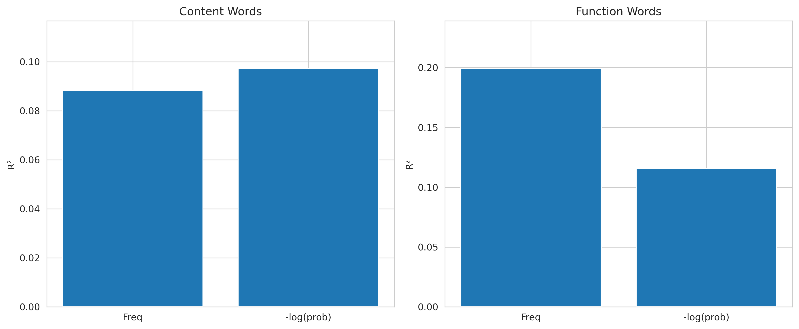
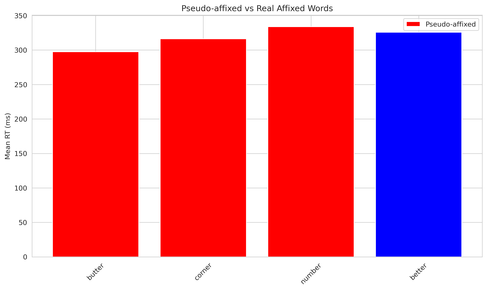

# Word Processing Assignment Report

**Code Repository:** [GitHub Link - To be added]

---

## Part I: Preliminary Data Analysis

### Data Overview
- Total observations: 848,875 reading time recordings
- Unique words analyzed: 8,301
- Average mean RT: 334.07 ms

### Correlation Analysis

**1. Length vs Frequency**
- Pearson r = -0.7121 (p < 0.001)
- Strong negative correlation: longer words tend to be less frequent

**2. Length vs Mean RT**
- Pearson r = 0.3093 (p < 0.001)
- Moderate positive correlation: longer words take more time to read

**3. Log Frequency vs Mean RT**
- Pearson r = -0.2525 (p < 0.001)
- Moderate negative correlation: more frequent words are read faster

### Visualizations

### Summary
Word length, frequency, and reading time exhibit systematic relationships. Longer words require more processing time (r=0.31), while frequent words are processed faster (r=-0.25). The strong negative correlation between length and frequency (r=-0.71) reflects Zipf's law - frequent words tend to be shorter. These patterns suggest dual influences on reading time: visual/motor factors (length) and lexical access efficiency (frequency).

---

## Part II: Hypothesis Testing

### Hypothesis 1: LM Probabilities vs Word Frequency

**Models Compared:**
- Model 1: Mean RT ~ word_freq + word_length (R² = 0.0976, MSE = 453.68)
- Model 2: Mean RT ~ -log(P_trigram) + word_length (R² = 0.1020, MSE = 451.47)

**Result:** Model 2 performs better (Delta R² = 0.0044, Delta MSE = -2.21)

Language model probabilities, derived from trigram conditional probabilities, provide stronger predictive power than simple word frequency. The -log(probability) metric captures contextual predictability, aligning with surprisal theory in psycholinguistics. Despite modest R² values, the consistent improvement supports expectation-driven processing during reading.

### Hypothesis 2: Content vs Function Words

**Content Words:**
- Model 1 (freq + length): R² = 0.0883
- Model 2 (-log prob + length): R² = 0.0973
- Better predictor: -log(probability) (Delta = 0.0090)

**Function Words:**
- Model 3 (freq + length): R² = 0.1993
- Model 4 (-log prob + length): R² = 0.1158
- Better predictor: frequency (Delta = -0.0835)

**Analysis:** Content and function words exhibit distinct processing patterns. For content words, contextual predictability (-log prob) explains variance better, suggesting semantic integration processes. For function words, raw frequency dominates, indicating automatic, lexicalized retrieval. Function words show higher overall R² values, likely due to their limited set and consistent usage patterns. This dissociation supports dual-route models distinguishing compositional vs. lexical processing.

---

## Part III: FOBS Model

### Hypothesis 1: Root vs Surface Frequency

**Models Compared:**
- Model 1: Mean RT ~ surface_freq + word_length (R² = 0.0972)
- Model 2: Mean RT ~ lemma_freq + lemma_length (R² = 0.0953)

**Result:** Surface frequency performs marginally better (Delta R² = 0.0019)

The FOBS model predicts lemma frequency should dominate due to morphological decomposition. Results show minimal difference, suggesting:
1. Limited morphological complexity in this corpus
2. Whole-word representations may compete with decomposed access
3. English inflectional morphology is relatively impoverished
4. Surface forms might be stored directly for high-frequency words

### Hypothesis 2: Pseudo-affixed vs Real Affixed Words

**Test Words:**
- Pseudo-affixed: finger, corner, butter, winter, number
- Real affixed: singer, owner, better, winner, hunter

**Results:**
- Pseudo-affixed mean RT: 323.12 ms
- Real affixed mean RT: 325.73 ms
- Difference: -2.61 ms (opposite to hypothesis)

**Analysis:** Contrary to hypothesis, pseudo-affixed words showed slightly faster RTs. The FOBS model predicts pseudo-affixed words should require additional search operations when decomposition fails. Possible explanations:
1. Sample size limitations (n=10 total)
2. Frequency/length matching imperfect despite selection criteria
3. Individual word idiosyncrasies dominate small-sample effects
4. Both types may use whole-word representations in fluent reading contexts
5. The "-er" suffix ambiguity may not trigger decomposition attempts

A larger, better-controlled study with matched psycholinguistic variables would be needed to properly test this hypothesis.

---

## Conclusions

1. **Frequency Effects:** Word frequency robustly predicts reading time (r=-0.25), confirming lexical access efficiency.

2. **Length Effects:** Word length shows moderate positive correlation with RT (r=0.31), reflecting visual/motor processing demands.

3. **Contextual Predictability:** Trigram-based surprisal outperforms raw frequency for overall predictions and specifically for content words, supporting predictive processing theories.

4. **Word Class Differences:** Function and content words show differential sensitivity to frequency vs. contextual predictability, consistent with dual-route processing models.

5. **Morphological Processing:** Limited evidence for morphological decomposition effects. Surface frequency performs comparably to lemma frequency, and pseudo-affix penalty not observed in small sample.

6. **Model Performance:** All models show modest R² values (0.09-0.20), indicating reading time variance is influenced by many factors beyond those captured here (e.g., sentence context, working memory, individual differences).

**Methodological Note:** Analysis used Natural Stories corpus (848K observations, 8.3K unique words) with Google Books n-gram frequencies. Trigram conditional probabilities approximated language model predictions. Statistical significance achieved for all correlations (p < 0.001) despite effect size variation.
